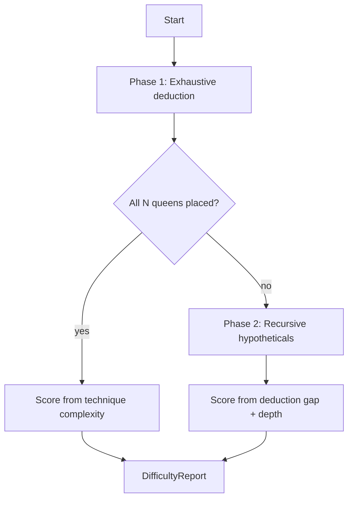
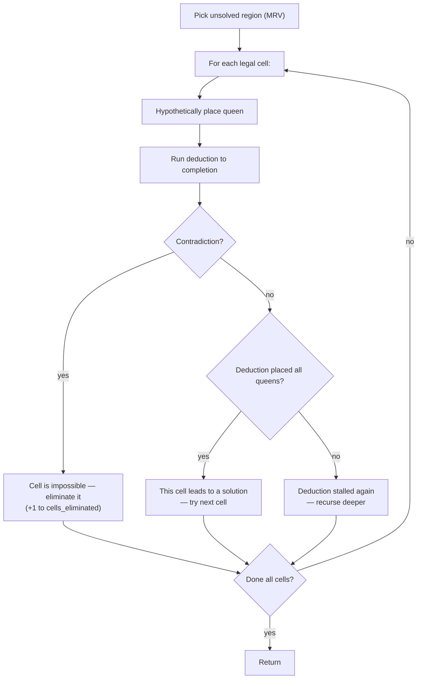

# Difficulty analysis

The difficulty engine measures how hard a board is to solve
*objectively* — by running the same deduction techniques a human
would use, then falling back to hypothetical reasoning when
deduction stalls.

Source: `src/queens/difficulty.py`

---

## Two-phase analysis



---

## Phase 1: Exhaustive deduction

Deduction iterates through four techniques in priority order.
On each iteration, if any technique makes progress (places a
queen or marks a cell), restart from the top. This mimics how
a human player iterates between strategies.

### Technique 1: Forced singleton

> *"This region has only one legal cell left — the queen must go there."*

```python
for each unsolved region:
    legal_cells = cells not blocked by rows, cols, adjacency
    if len(legal_cells) == 1:
        place queen there
```

Weight: 0.1 per occurrence (easiest technique).

### Technique 2: Region line lock

> *"Every cell in this region shares the same row (or column).
> The queen must be in that row — block the rest of the row
> from other regions."*

```python
for each unsolved region:
    rows = {row of each legal cell}
    if len(rows) == 1:
        # All cells in same row → block this row for other regions
        for other_region in unsolved_regions:
            mark cells in locked_row as unavailable
```

Weight: 0.3 per occurrence.

### Technique 3: Region group lock

> *"This region's cells are all confined to a 2×2 (or 3×3)
> sub-grid. Queens can't be adjacent, so the placement is
> forced by geometry."*

Generalizes the line lock: if all legal cells of a region
occupy only 2 rows and 2 columns, the 2×2 sub-grid is
"locked" for that region, and adjacent cells become
unavailable.

Weight: 0.6 per occurrence.

### Technique 4: Diagonal elimination

> *"If placing a queen at cell X would make a neighboring region
> unsolvable, X cannot be a queen."*

For each unsolved region with 2 legal cells, try placing at
each one. If one placement makes another region have 0 legal
cells (via adjacency blocking), eliminate that cell.

Weight: 0.5 per occurrence.

---

## Scoring from deduction alone

If deduction places all N queens:

```
score = sum(technique_weight × count) / N
```

Capped at 0.99 (trivial). A board solved entirely by forced
singletons scores ~0.1-0.3. A board requiring deep group locks
scores ~0.5-0.8.

---

## Phase 2: Recursive hypothetical search

When deduction stalls with queens unplaced, the engine falls
back to hypothetical reasoning:

> *"I don't know where the queen goes in region R. Let me try
> cell A — if that leads to contradiction, it must be cell B."*



### Metrics tracked

| Metric | Meaning |
|--------|---------|
| `max_hypo_depth` | Deepest nested hypothesis level (0 = no guessing needed) |
| `hypotheses_tested` | Total cells tested across all depths |
| `cells_eliminated` | Cells proven impossible by hypotheticals |
| `deduction_placed` | Queens placed before any hypothesis was needed |

---

## Scoring formula (with hypotheticals)

```
deduction_gap = 1.0 - (deduction_placed / N)
elimination_yield = cells_eliminated / max(hypotheses_tested, 1)

score = deduction_gap × 10

# Depth multiplier
if depth == 0:  score × 0.5   (hypotheticals stalled too — stuck)
if depth == 1:  score × 1.0   (single-level reasoning)
if depth == 2:  score × 1.5   (nested "if this then that")
if depth >= 3:  score × 2.0   (deep chains of reasoning)

# Yield penalty
score × (2.0 - elimination_yield)
```

The yield penalty means: if every hypothesis eliminates a cell
(high yield, efficient reasoning), the score is lower. If you
test many cells but eliminate few (low yield, brute-force-ish),
the score is higher.

---

## Difficulty classes

| Class | Score range | What it means |
|-------|------------|---------------|
| Trivial | 0.0 – 1.0 | Solved entirely by deduction |
| Easy | 1.0 – 2.0 | Mostly deduction, one or two simple hypotheticals |
| Medium | 2.0 – 4.0 | Requires several hypotheticals at depth 1 |
| Hard | 4.0 – 7.0 | Depth 2-3 hypotheticals, many cells tested |
| Expert | 7.0 – 10.0 | Deep nested reasoning, low elimination yield |
| Master | 10.0+ | Maximum difficulty |

---

## Example: 5×5 seed 42

```
Difficulty: 0.4 (trivial) | 5/5 by deduction
```

All 5 queens placed by deduction — no hypotheticals needed.
Two forced singletons and one line lock contributed:

```
techniques_used: ("forced_singleton", "forced_singleton", "region_line_lock")
score = (0.1 + 0.1 + 0.3) / 5 = 0.10
```

---

## Why this approach?

Many puzzle generators use hand-tuned difficulty labels. This
engine measures difficulty *objectively* by running the actual
solving process. A board that requires 3 levels of nested
hypothetical reasoning is measurably harder than one solved
by forced singletons — regardless of how the regions look.

This also means difficulty scores are **comparable across
board sizes** — a 5×5 scoring 7.0 requires the same depth of
reasoning as a 10×10 scoring 7.0.

---

**Related tests:** `tests/test_difficulty.py`  
**Source:** `src/queens/difficulty.py`
