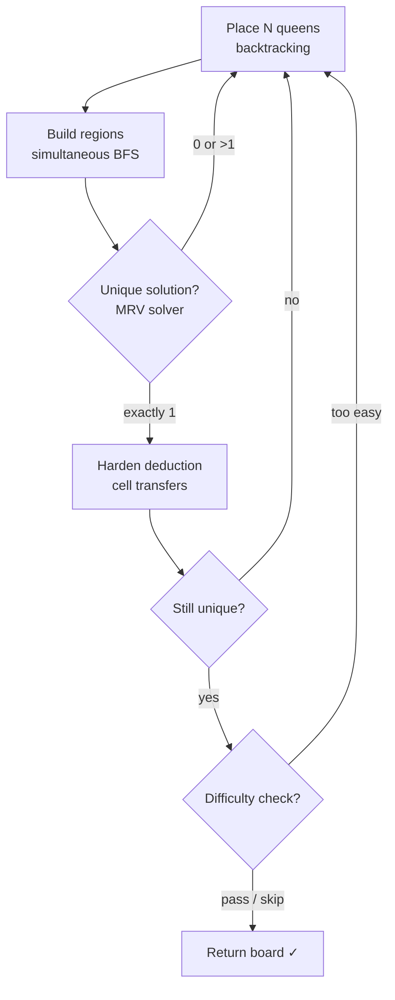
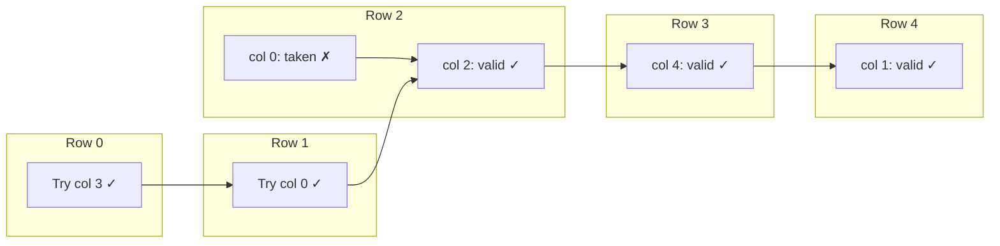

# Board generation pipeline

A Monte Carlo pipeline that produces valid Queens boards. Each
attempt is independent — if it fails, a fresh attempt starts with
a different random seed. This guarantees diversity and avoids
local minima.



The pipeline is in `src/queens/generator.py` — the `generate_board`
function. It delegates to four subsystems:

| Phase | Module | What it does |
|-------|--------|-------------|
| Placement | `placement.py` | Places N queens with row/col/anti-adjacency constraints |
| Regions | `regions.py` | Builds connected coloured regions around each queen |
| Solver | `solver.py` | Counts solutions to verify uniqueness |
| Hardening | `generator.py` | Transfers cells to break deduction patterns |

---

## Walkthrough: generating a 5×5 board

We'll trace through a successful generation with seed 42.
The final board looks like this (queens marked ♛, numbers are
region IDs):

```
   0 1 2 3 4
 0 1 1 2 ♛ 0
 1 ♛ 1 2 2 2
 2 1 2 ♛ 2 2
 3 4 4 4 2 ♛
 4 4 ♛ 4 4 3
```

Difficulty: 0.4 (trivial), completely solvable by deduction.

---

## Phase 1: Queen placement (backtracking)

The first step is placing N queens that satisfy the *global*
constraints — one per row, one per column, and no two adjacent
(including diagonals). The region constraint is not considered
here — regions don't exist yet.



The `backtracking_placement` function (`src/queens/placement.py`)
works row by row. For each row, it shuffles the available columns
and tries the first one that doesn't conflict with:

1. **Same column** — a set tracks used columns
2. **Adjacency** — checks all 8 neighbors of candidate cell against
   already-placed queens

If a row has no valid column, it backtracks to the previous row
and tries the next column. Column shuffling ensures different
placements across seeds.

For our seed 42, the backtracker found:

```
Queen positions: (0,3), (1,0), (2,2), (3,4), (4,1)
```

These satisfy: one per row ✓, one per column ✓, no two touch ✓.

---

## Phase 2: Region building (simultaneous BFS)

Now we assign every cell to one of the N regions, each anchored
at a queen position. The approach is a **simultaneous BFS** —
like a Voronoi diagram grown outward from each seed.

```
Step 0 (seeds only)        Step 3                   Step 10
 .  .  .  0  .            .  .  .  0  .            1  1  .  0  0
 .  .  .  .  .            1  .  .  .  .            1  1  2  .  .
 .  .  2  .  .      →     1  .  2  .  .      →     1  2  2  2  2
 .  .  .  .  3            .  .  .  .  3            4  .  2  .  3
 .  4  .  .  .            .  4  .  .  .            4  4  .  .  3
```

The algorithm (`_simultaneous_bfs` in `src/queens/regions.py`):

1. Initialize an N×N grid with `-1` (unclaimed). Place seeds at
   queen positions with their region IDs.

2. Maintain a queue per region. On each iteration, pick a random
   region (weighted by queue length — larger regions grow faster),
   pop a cell from its queue, and claim any unclaimed 4-directional
   neighbors.

3. Repeat until all N×N cells are claimed.

Weighted selection ensures regions grow proportionally — no
region gets starved while another dominates the grid.

After BFS growth completes, we have connected regions but no
guarantee of uniqueness. Most random BFS boards have multiple
solutions.

---

## Phase 3: Uniqueness verification (MRV solver)

The solver (`count_solutions` in `src/solver.py`) counts valid
queen placements. It uses:

- **MRV heuristic**: always pick the region with the fewest legal
  cells remaining. This minimizes branching factor.
- **Forward checking**: after placing a queen, check if any
  unsolved region has zero legal cells. If so, backtrack immediately.

We call `count_solutions(board, limit=2)`. If it returns exactly 1,
the board is valid. If 0 or 2+, discard and retry.

For our seed 42, the BFS board happened to have exactly one
solution on the first try. This is unusually lucky — for N=5
without hardening, roughly 60-70% of BFS boards have multiple
solutions.

---

## Phase 4: Deduction hardening

Even with a unique solution, a board might be solvable by
trivial deduction — looking at forced singletons and line locks
rather than reasoning. The hardening phase intentionally transfers
cells between regions to break these patterns.

The algorithm (`_harden_deduction_resistance`):

1. Run the full deduction engine on the current board.
2. If deduction places all N queens, the board is too easy.
   Find the first deduction step (a forced singleton or line lock)
   and transfer a neighboring cell to break it.
3. Re-verify uniqueness after each transfer. If uniqueness is
   lost, undo and stop.

**Example: breaking a forced singleton**

Suppose region 3 has only one legal cell at (3,4) after all other
queens are placed by deduction. The hardening finds a neighbor
cell from a different region — say (3,3) from region 2 — and
transfers it to region 3, provided:

- Region 2 doesn't become disconnected by losing (3,3)
- The resulting board still has exactly one solution

Now region 3 has cells at (3,3) and (3,4) — no longer a forced
singleton. Deduction can't trivially solve this anymore.

For our seed 42, the board scored 0.4 (trivial) — deduction
placed all 5 queens, but each hardening iteration either broke
uniqueness or already placed all queens, so hardening stopped
early.

---

## Phase 5: Difficulty filtering (optional)

If a target difficulty is specified, the board's score is computed
by `exhaustive_analyze` (see [difficulty analysis](difficulty.md)).
If the score is below the target, the board is discarded and a
new attempt begins.

---

## The retry loop

```python
for attempt in range(max_attempts):
    placement = place_func(n, rng)         # Phase 1
    board = region_func(n, placement, rng)  # Phase 2
    if count_solutions(board, limit=2) != 1:  # Phase 3
        continue
    if harden:
        board = harden(board)              # Phase 4
        if count_solutions(board, limit=2) != 1:
            continue
    if target and difficulty(board) < target:  # Phase 5
        continue
    return board

raise GenerationError("failed after N attempts")
```

Each iteration is independent — the random state advances,
producing a completely different placement and region layout.
Typical success rates (with BFS builder, no difficulty target):

| N | ≈ success rate | ≈ time per success |
|---|---------------|-------------------|
| 5 | 60-70% | < 1ms |
| 8 | 30-40% | 5-10ms |
| 10 | 15-25% | 20-50ms |
| 12 | 5-10% | 100-300ms |

---

**Related tests:** `tests/test_generator.py`,  `docs/spec/generate.md`
**Source:** `src/queens/generator.py`, `src/queens/placement.py`,
`src/queens/regions.py`
