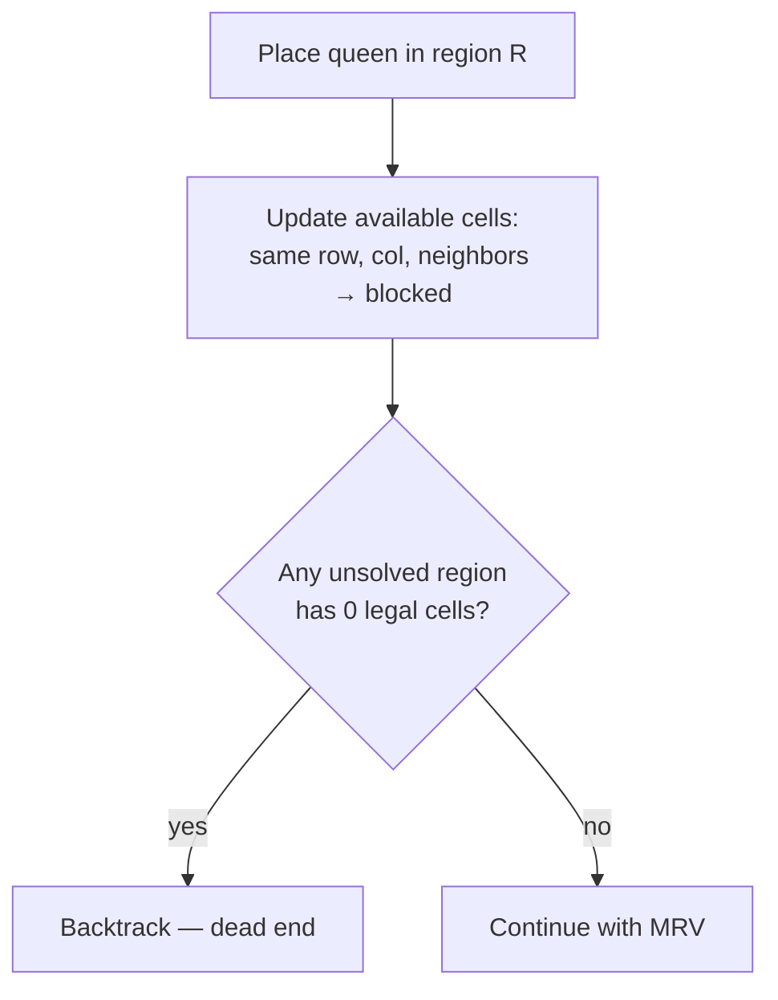

# MRV solver

The constraint solver finds all valid queen placements for a board.
It uses backtracking with the **Minimum Remaining Values (MRV)**
heuristic and forward checking for efficient pruning.

Source: `src/queens/solver.py`

---

## Problem constraints

A valid placement must satisfy four constraints simultaneously:

1. **One queen per row**
2. **One queen per column**
3. **One queen per coloured region**
4. **No two queens are adjacent** (all 8 neighbors)

There are exactly N queens on an N×N board. Each region contains
exactly one.

---

## Why MRV?

A naive solver would iterate over rows or columns. But regions
vary wildly in size — one region might have 3 cells while another
has 15. The region with 3 cells is far more constrained.

**MRV always picks the unsolved region with the fewest legal
cells.** This minimizes the branching factor at each step.

```
Example: 5×5 board from the generation walkthrough

Region sizes (total cells / legal cells after placements):
  Region 0: 2 cells  → try first (most constrained)
  Region 1: 5 cells  → try third
  Region 2: 11 cells → try last (least constrained)
  Region 3: 2 cells  → try second
  Region 4: 5 cells

Order: 0, 3, 1, 4, 2  (ties broken arbitrarily)
```

If we picked region 2 first (11 legal cells), the search tree
would have 11 branches at depth 0. MRV picks region 0 first
(2 legal cells) — only 2 branches.

---

## Forward checking

After placing a queen, the solver checks: does any unsolved
region now have **zero legal cells**? If so, this branch is dead
— backtrack immediately.



This prunes branches that would otherwise be explored deeply
before failing.

---

## The `_place` / `_unplace` pattern

The solver uses an explicit place/unplace pattern for efficient
state management:

```python
def _place(r, c):
    affected = []
    # Block entire row
    for cc in range(n):
        if available[r][cc]:
            available[r][cc] = False
            affected.append((r, cc))
    # Block entire column
    for rr in range(n):
        if available[rr][c]:
            available[rr][c] = False
            affected.append((rr, c))
    # Block 8 neighbors
    for dr, dc in NEIGHBORS:
        nr, nc = r + dr, c + dc
        if in_bounds and available[nr][nc]:
            available[nr][nc] = False
            affected.append((nr, nc))
    # Mark region as solved
    region_has[region_id] = True
    return affected, region_id

def _unplace(affected, region_id, r, c):
    for cr, cc in affected:
        available[cr][cc] = True
    region_has[region_id] = False
```

The `affected` list tracks exactly which cells were changed,
so `_unplace` restores only those — not the entire grid.
This is O(affected) instead of O(N²) per backtrack step.

---

## Why `limit=2`?

During generation, we only care whether the board has:

- **0 solutions** → invalid, discard
- **1 solution** → valid, keep
- **2+ solutions** → invalid, discard

We don't need to count all solutions — stopping at 2 saves
enormous time for boards with many solutions (common for
easy boards before hardening).

```python
# In the solver's _solve():
if count >= limit:
    return True  # Stop the search
```

---

## Complexity

| Case | Time | When |
|------|------|------|
| Best | O(N²) | Unique solution found on first MRV path |
| Typical | O(N³) | Some backtracking, forward checking prunes most |
| Worst | O(N!) | No pruning — every placement is legal (degenerate board) |

In practice, the solver is fast because:

1. MRV keeps branching factor low
2. Forward checking catches dead ends early
3. `limit=2` stops counting as soon as uniqueness is disproven
4. N ≤ 15 — the search space is bounded

---

## Variants

The module provides three entry points:

| Function | Returns | Use case |
|----------|---------|----------|
| `count_solutions(board, limit)` | Integer count | Generation: "is it unique?" |
| `find_up_to_k_solutions(board, k)` | List of placements | Region refinement: "what are the alternatives?" |
| `find_all_solutions(board)` | All placements | Debugging, verification |

All three share the same MRV engine — only the termination
condition differs.

---

**Related tests:** `tests/test_solver.py`
**Source:** `src/queens/solver.py`
